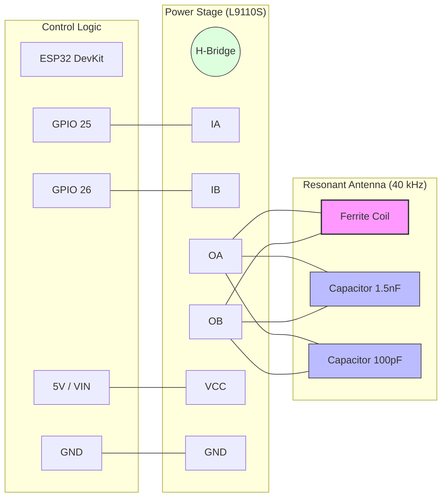

# Fork notes

Warning: Vibe coded with Qwen 3.6 27B running on my local machine.

## Features
* split code into multiple files
* replaced Tailwind with raw CSS
* enabled cold boot/scheduled/permanent broadcast
* enabled scheduled/permanent on Wifi
* settings saved/restored automatically
* added FreeCAD source for a more generic case + lid (not vibe coded)

## My build notes
I used a 9mm X 100mm ferrite core and wound 80mm of 0.35mm enameled wire. Bought the same capacitors but measured about 1.7nF of capacitance so I redid the antenna math, changed the number of turns a bit (about 290) and it worked on the first try.

## TODO
Some minor cleanup of the code and UI

--------------------------------
# JJY 40 kHz Simulator for ESP32

This project is a high-performance JJY (Fukushima 40 kHz) time signal simulator designed for ESP32 and the L9110S motor driver. It allows you to synchronize radio-controlled clocks (like those from Casio, Citizen, etc.) by simulating the Japanese JJY time signal.

Detailed project documentation and build log can be found here: [JJY Signal Simulator with ESP32 — 5m Range DIY Build](https://olafkrawczyk.com/journal/jjy-signal-simulator/)

## Motivation

Radio-controlled clocks designed for the Japanese market are often hardwired to listen only for the JJY longwave signal. Outside of Japan, these clocks cannot sync and must be set manually. This project "brings the signal to the clock" by creating a local transmitter that broadcasts the JJY protocol, allowing these "self-correcting" devices to function as intended anywhere in the world.

## Parts List

| Component | Specification / Detail |
| :--- | :--- |
| **Microcontroller** | ESP32 DevKitV1 (ESP-WROOM-32) |
| **Power Amplifier** | L9110S dual-channel motor driver |
| **Ferrite Core** | 2× 50mm NiZn ferrite rods (bonded to 100mm) |
| **Coil Wire** | ~11m enameled copper wire (~250–300 turns) |
| **Resonant Capacitor 1** | ~1.5 nF MKP film capacitor (Primary resonance) |
| **Resonant Capacitor 2** | ~100 pF ceramic disc capacitor (Fine-tuning/Trimming) |
| **Power** | Micro-USB cable + 5V supply |

## Hardware Setup

The project uses an "Antiphase drive" concept to increase the voltage swing across the transmission tank circuit.

- **MCU:** ESP32
- **Driver:** L9110S (or similar H-bridge)
- **Connections:**
  - `PIN_IA` (GPIO 25) -> L9110S IA
  - `PIN_IB` (GPIO 26) -> L9110S IB
  - `PIN_TX_LED` (GPIO 2/Built-in) -> Transmission status LED

### Wiring Diagram

#### Physical Layout (ASCII)
```text
      ESP32 DevKit                L9110S Driver
    +--------------+            +--------------+
    |   [USB]      |            |              |
    |          VIN |------------| VCC (5V)     |
    |          GND |------------| GND          |
    |      GPIO 25 |------------| IA           |
    |      GPIO 26 |------------| IB           |
    +--------------+            |              |
                                |   OA    OB   |
                                +---|-----|----+
                                    |     |
            +-----------------------+     |
            |                             |
            |     +-------+-------+       |
            +-----|  COIL |  C1   |  C2   |
            |     | (Ant) | 1.5nF | 100pF |
            +-----|       |       |       |
            |     +-------+-------+       |
            |       (Parallel Tank)       |
            +-----------------------------+
```

#### Schematic Flow (Mermaid)


### Simplified Pin Mapping

| ESP32 Pin | L9110S Pin | Notes |
| :--- | :--- | :--- |
| GPIO 25 | IA | PWM Signal A |
| GPIO 26 | IB | PWM Signal B (Inverted) |
| GND | GND | Common Ground |
| VIN (5V) | VCC | Driver Power |
| - | OA | Antenna Out A |
| - | OB | Antenna Out B |

## Configuration

Before flashing, create a `include/secrets.h` file based on `include/secrets.h.example` and fill in your WiFi credentials:

```cpp
#ifndef SECRETS_H
#define SECRETS_H

#define WIFI_SSID "your_ssid"
#define WIFI_PASS "your_password"

#endif
```

## Features

- **Antiphase PWM Drive:** 40 kHz carrier frequency with configurable duty cycle.
- **NTP Synchronization:** Automatically fetches precise time from NTP servers.
- **Scheduled Transmissions:** Configurable transmission slots throughout the day.
- **Web Interface:** Basic web UI for status monitoring and frequency adjustment.
- **Deep Sleep:** Power-saving mode between scheduled transmission slots.

## License

This project is licensed under the MIT License - see the [LICENSE](LICENSE) file for details.
